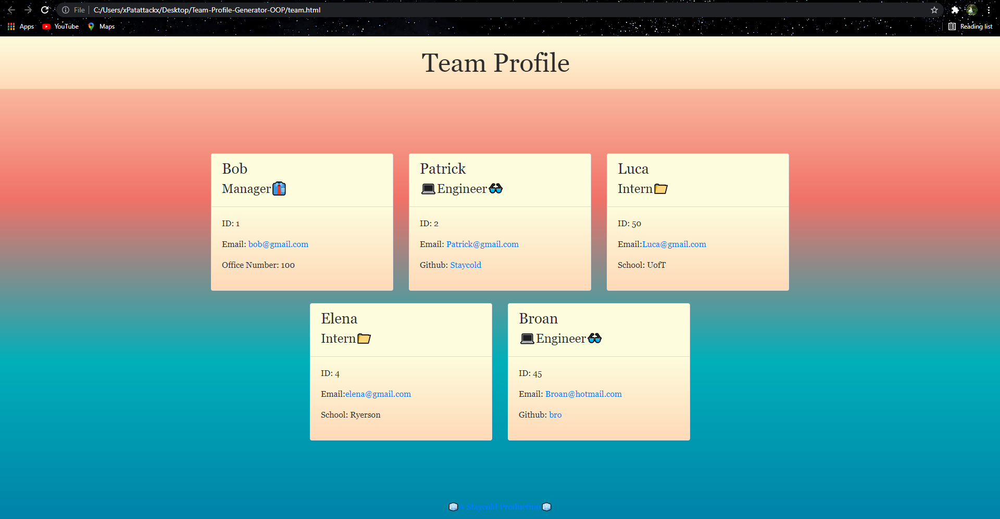

# Team-Profile-Generator-OOP

<h1> Welcome! To the Object-Oriented-Programmed, TEAM PROFILE GENERATOR!!! </h1>

## What's inside:
*[Criteria](#criteria)
    
*[Link to Video](#link-to-video)

*[Link to Repo](#link-to-github)
    
*[Sneak Peek](#sneak-peek)
    

## Criteria
<h3> Here are the project criteria, should you choose to accept them </h3>

<ul>

  <li>GIVEN a command-line application that accepts user input</li>
<li>WHEN I am prompted for my team members and their information
THEN an HTML file is generated that displays a nicely formatted team roster based on user input</li>
<li>WHEN I click on an email address in the HTML
THEN my default email program opens and populates the TO field of the email with the address</li>
<li>HEN I click on the GitHub username
THEN that GitHub profile opens in a new tab</li>
<li>WHEN I start the application
THEN I am prompted to enter the team manager’s name, employee ID, email address, and office number</li>
<li>WHEN I enter the team manager’s name, employee ID, email address, and office number
THEN I am presented with a menu with the option to add an engineer or an intern or to finish building my team</li>
<li>WHEN I select the engineer option
THEN I am prompted to enter the engineer’s name, ID, email, and GitHub username, and I am taken back to the menu</li>
<li>WHEN I select the intern option
THEN I am prompted to enter the intern’s name, ID, email, and school, and I am taken back to the menu</li>
<li>WHEN I decide to finish building my team
THEN I exit the application, and the HTML is generated</li>

</ul>

 this message will self-destruct in 30 seconds

## Link to video:
https://drive.google.com/file/d/1DavGP96CQuc66TPbgDcOgUs3ylV673M_/view

## Link to GitHub:
https://github.com/Staycold/Team-Profile-Generator-OOP

## Sneak peek. 
https://staycold.github.io/Team-Profile-Generator-OOP/

